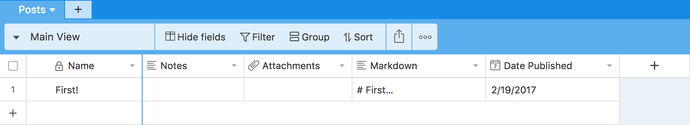

# Airtable Blog

This project demonstrates using [Next.js](https://github.com/zeit/next.js) to server-side render markdown in React using the [`markdown-it-renderer`](https://github.com/ccorcos/markdown-it-renderer), and hosting all of the blog posts on [Airtable](airtable.com).

Admittedly, there are some hacks going on here, but the point is to create a proof of concept for a simple microservice with a low amount of developer maintainence.

Furthermore, `markdown-it-renderer` is built in such a way that you should be able to create you're own custom components and render them in markdown. More on that soon...

## Getting Setup

Sign up with [Airtable](https://airtable.com), create a new "base" with a table named "Posts". Add two fields -- "Markdown" should be a *Long text* field, and "Date Published" should be a *Date* field. Create a demo post, and it should look like this:



Now clone this repo, create a file called `env.sh`, and install the NPM dependencies:

```sh
git clone git@github.com:ccorcos/airtable-blog.git
cd airtable-blog
touch env.sh
npm install
```

Inside `env.sh` you need to export three variables:

```sh
export AIRTABLE_API_KEY='XXX'
export AIRTABLE_BASE_NAME='XXX'
export PASSWORD='XXX'
```

You can create an Airtable api key [here](https://airtable.com/account).

You can get the base name by going [here](https://airtable.com/api) clicking on the base you just created, and then looking at the very first example -- there should be a cURL request that looks like this:

```sh
curl https://api.airtable.com/v0/$AIRTABLE_BASE_NAME/Posts \
-H "Authorization: Bearer YOUR_API_KEY"
```

Lastly, set up a password you are going to use to authenticate requests for creating posts.

You can run it locally:

```js
npm run dev
```

Or you can throw it up on the interwebs with [Now.sh](https://now.sh/)

```sh
npm run deploy
```
